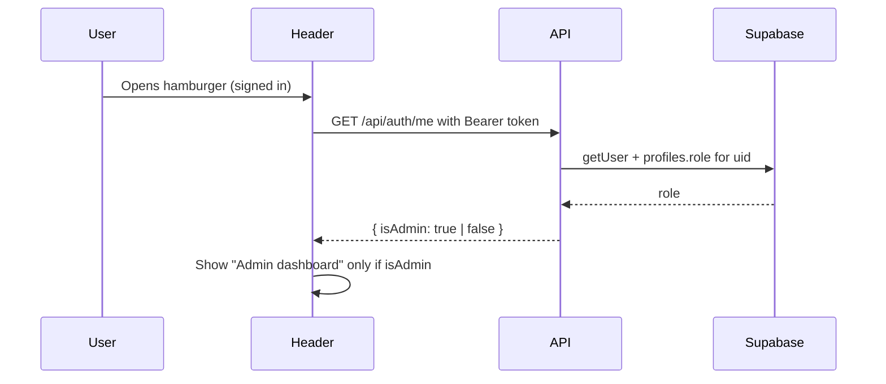
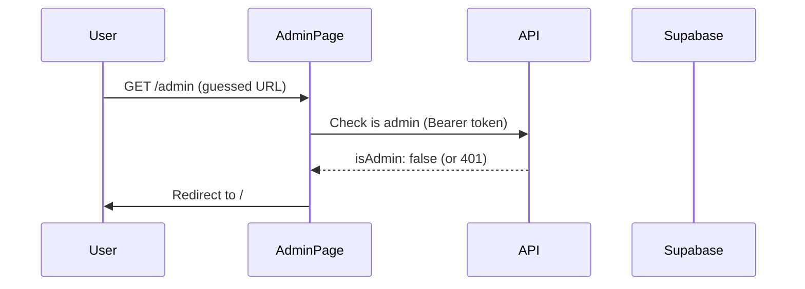

# Admin dashboard link: visible only to admins

**Date:** 2026-03-02  
**Summary:** Hide the "Admin dashboard" hamburger link from non-admins and add server-side checks so the `/admin` page and API are only usable by admins. Non-admins who guess the URL are redirected and cannot see or use the admin UI.

---

## Problem

In [components/Header.js](components/Header.js), the hamburger menu shows an "Admin dashboard" link to **every signed-in user**. The condition is only `user` (truthy when authenticated). Anon users do not see it, but any authenticated user does—so non-admin users can see and try to open `/admin`. The link must be shown **only** when the current user is an admin; anon and regular auth users must never see it.

## Current behavior

- **Header:** Renders "Admin dashboard" whenever `user` is set (any signed-in user).
- **Backend:** Admin API ([app/api/admin/[resource]/route.js](app/api/admin/[resource]/route.js)) only checks that the user is authenticated; RLS on admin resources uses `is_admin()` so non-admins get no data / errors. The **route and data are already protected**; the issue is **UI disclosure** and defense-in-depth so someone guessing `/admin` cannot wreak havoc or even see the admin UI.

## Source of admin status

- Admin status is determined by **profiles.role** (e.g. `role === 'admin'`). The DB uses an `is_admin()` function in RLS. The app convention is admin = `profiles.role === 'admin'`.

## Implementation

### 1. New API route (e.g. `GET /api/auth/me` or `GET /api/admin/check`)

- Read Bearer token from `Authorization` header.
- Use [lib/supabase/authed-server.js](lib/supabase/authed-server.js) to get a Supabase client with that token, then `auth.getUser()`. If no user, return `401` or `{ isAdmin: false }`.
- Query the server-side Supabase client for the current user’s profile: e.g. `from('profiles').select('role').eq('id', user.id).single()`.
- Return `{ isAdmin: true }` only when `data?.role === 'admin'`, otherwise `{ isAdmin: false }`.
- Do not return the role value or any admin URL; only the boolean.

### 2. Header.js

- Add state: e.g. `isAdmin` (boolean, default `false`) and optionally `adminCheckDone` so the link never flashes.
- When `user` is set (signed in), call the new API with `Authorization: Bearer <session.access_token>`.
- Set `isAdmin` from the response.
- Render the "Admin dashboard" link **only when `user && isAdmin === true`**.
- Keep "View my profile" and "Sign out" visible for any signed-in user.

### 3. Admin page hardening (required)

To prevent anyone who guesses `/admin` from seeing the admin UI or causing harm:

- **Admin page** ([app/admin/page.js](app/admin/page.js) or [components/admin/AdminClient.js](components/admin/AdminClient.js)): On load, check that the current user is an admin (e.g. call the same "is admin" API, or call `GET /api/admin/plant_catalog` with the session token).
- If the response indicates non-admin (401, 403, or empty/error from an admin resource), **immediately redirect to `/`** (or show a minimal "Access denied" and redirect). Do not render the admin tabs or any admin UI.
- This way:
  - Non-admins never see the admin interface.
  - They cannot probe or abuse the page; they are sent away.
  - RLS still protects all data; this adds a clear UX and security layer so the admin surface is hidden and inaccessible to non-admins.

### Flow (high level)

When a non-admin visits `/admin` directly:

## Files to add/change

| Action | File |
|--------|------|
| Add | New route, e.g. `app/api/auth/me/route.js` (or `app/api/admin/check/route.js`) that returns `{ isAdmin }` |
| Edit | [components/Header.js](components/Header.js): add `isAdmin` state, fetch from new API when user is set, render "Admin dashboard" only when `isAdmin === true` |
| Edit | [app/admin/page.js](app/admin/page.js) or [components/admin/AdminClient.js](components/admin/AdminClient.js): on mount, call is-admin check; if not admin, redirect to `/` and do not render admin UI |

## What we are not changing

- **RLS:** No changes to Supabase RLS or policies (per workspace rules).
- **Admin API:** No change to admin resource route logic; they already rely on RLS. Optionally the admin API could return 403 when the user is authenticated but not admin (for clearer hardening); that can be a follow-up if desired.

## Documentation

- **Project-Decisions.md:** Note that the hamburger "Admin dashboard" link is shown only when the user’s profile has `role === 'admin'`, and that `/admin` redirects non-admins to home.
- **Project-Simple-Decisions.md:** One sentence that the admin link and page are only for admins; non-admins are redirected.
- **API.md:** Document the new endpoint (path, method, response shape, purpose).
