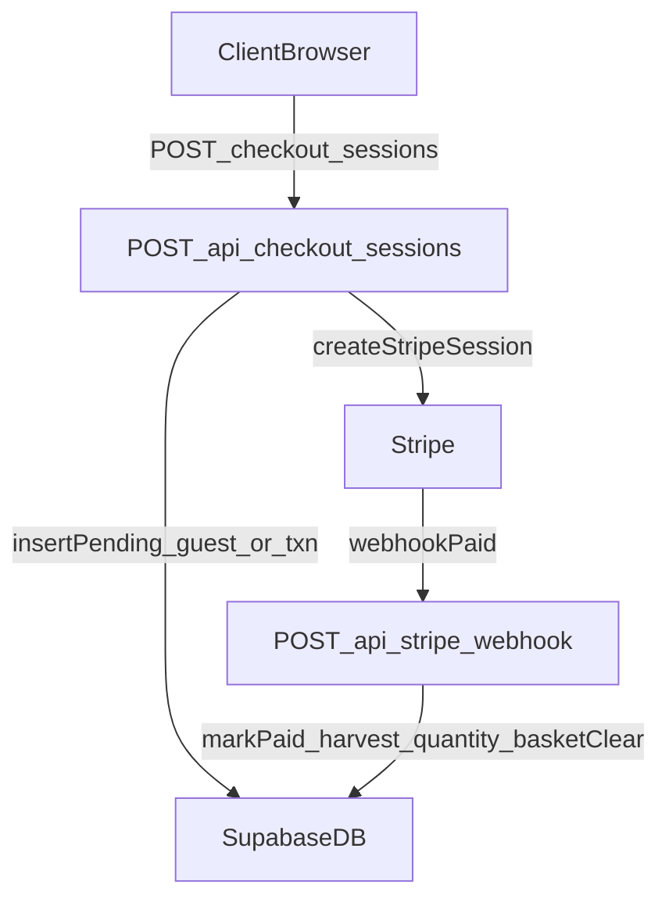

# Payment Flow (App Router)

**Date:** 2026-02-23

**Summary:** Define the server-side payment flow using Next.js App Router API routes on Vercel so pending records are created before Stripe, then finalized by webhook. Keep RLS locked down, keep client writes out of payment tables, and add user-facing error handling.

## Decisions locked in
- Server-side payment logic runs in **Next.js App Router route handlers** on Vercel.
- Client never writes to `guests`, `transaction`, or `harvest_quantity`. Sponsor tables (`sponsors_public`, `sponsors_private`) are display-only; no checkout or API writes to them.
- Server creates **pending** records (guests, transaction) before Stripe; webhook finalizes to **paid** and updates harvest_quantity/basket clear as applicable.
- User-facing payment errors are handled by **client + API responses** (webhooks are server-only).
- Payment flows: **shop → cart → payment**, **harvest → basket → payment**, **donate → payment** only. No sponsor/company checkout path.

## Flow overview

## Planned implementation tasks
1. **Define API routes (App Router)**
   - Create [`app/api/checkout/create/route.ts`](app/api/checkout/create/route.ts) for pending record insert + Stripe session creation.
   - Create [`app/api/stripe/webhook/route.ts`](app/api/stripe/webhook/route.ts) for Stripe confirmation updates.
   - Keep these routes thin: validate input → call business logic in `lib/` → return response.
2. **Business logic layer** (in `lib/checkout/`)
   - `createPendingCheckout()` writes `guests` (when guest) and does not write sponsor rows.
   - `insertTransactionForCheckoutSession()` writes `transaction` with `stripe_id`, `guest_id` or `user_id`.
   - Webhook calls `finalizeCheckoutByStripeId()`: sets `transaction.status`, writes `harvest_quantity` for basket payments, clears basket.
3. **Supabase access**
   - Use **service role** key in server routes only.
   - Use **anon key** in client for read-only data and user_preference updates.
   - Keep existing RLS policies unchanged for payment tables.
4. **Status handling**
   - Use `transaction.status` values: `pending`, `paid`, `failed` (or `abandoned`).
   - Ensure webhook updates use an idempotent lookup (Stripe event ID / payment intent ID).
5. **User-facing error handling**
   - API returns structured error codes for client display (e.g., `validation_failed`, `stripe_failed`, `payment_canceled`).
   - Client shows a clear message and keeps form state when payment fails or is canceled.
   - Webhook updates DB status but does not notify the user directly.
6. **Cleanup strategy**
   - Decide time window (e.g., 1–24 hours) for deleting pending records.
   - Implement cleanup as:
     - a scheduled Vercel cron route, or
     - a periodic admin job (simple endpoint run manually).
7. **Docs alignment**
   - Update [`organization/API.md`](organization/API.md) with the two endpoints and payload shapes.
   - If this is a locked decision, add it to [`organization/Project-Decisions.md`](organization/Project-Decisions.md) and mirror in [`organization/Project-Simple-Decisions.md`](organization/Project-Simple-Decisions.md).

## Files likely involved (when we implement)
- [`app/api/checkout/create/route.ts`](app/api/checkout/create/route.ts)
- [`app/api/stripe/webhook/route.ts`](app/api/stripe/webhook/route.ts)
- `lib/` payment flow modules
- [`organization/API.md`](organization/API.md)
- [`organization/Project-Decisions.md`](organization/Project-Decisions.md)
- [`organization/Project-Simple-Decisions.md`](organization/Project-Simple-Decisions.md)

## Notes / open items
- Guest email linking is deferred; revisit schema changes later.
- Confirm cleanup window before implementation.
