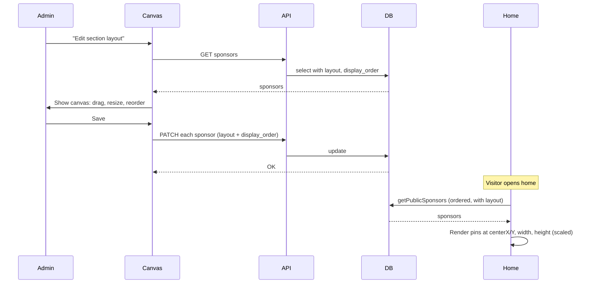

# Sponsors Section: OneNote-Style Canvas (Full Freedom)

**Date:** 2026-03-02  
**Summary:** Public "Our Generous Sponsors" shows only logo and company name. Admin gets a catalog of all sponsors (click to add to canvas) and a single canvas: drag, resize, stacking order, customizable canvas size; hover on a canvas item shows a close (X) to remove it from the section. Position = center (x,y), size = width × height. Save locks the layout for the home page.

---

## What “order” means (when placement is free)

**Where things are** is entirely **position**: centerX and centerY. You move a card by dragging it; that only updates its center. There is no “left-to-right order” or “grid order” — the canvas is free.

**Order** (`display_order`) is only for **stacking**: when two cards overlap, which one is drawn on top? Lower number = behind; higher number = in front. So you can think of it as “layer order” or “bring to front / send to back.” If cards never overlap, order doesn’t change how it looks; we still store it so the draw order is consistent (e.g. when you add a new sponsor it appears on top until you move it).

---

## Your question: polar vs Cartesian, and is this impossible?

**It’s not impossible.** A OneNote-style section with full freedom is doable without making things super complex.

**Polar coordinates (r, θ for center):**  
Would work mathematically, but we’d still have to convert to x,y to draw on the page. Moving something “a bit to the right” would change both r and θ, which is unintuitive. So polar doesn’t really simplify implementation.

**Simpler approach: Cartesian “center + size”**  
Store for each sponsor:

- **Center:** `centerX`, `centerY` (in the canvas coordinate system; see below — canvas size is customizable).
- **Size:** `width`, `height`.

That’s it. Drag = update center. Resize = update width/height. No polar math, and the DOM already thinks in x,y. So the plan uses **center (x, y) + width + height** — same idea as “polar coordinate of center” but in the coordinate system that’s easiest to implement and reason about.

---

## Current state

- **Home** ([app/page.js](app/page.js)): "Our Generous Sponsors" shows logo, company name, tier, company_url.
- **Data:** [sponsors_public](organization/Form-API-to-DB.md) has `id`, `company_name`, `tier`, `company_url`, `logo`, `created_at`. No layout or order.
- **Admin:** "Sponsors Card" tab is a table editor only; no canvas.

---

## 1. Public visibility: logo and name only

In [app/page.js](app/page.js), in the "Our Generous Sponsors" section, remove from the public card:

- Tier line.
- "Visit sponsor" link (company_url).

Keep: section heading and, per sponsor, **logo + company name only**.

---

## 2. Data model: one “pin” per sponsor (center + size + order) + canvas size

**Do we need to edit the DB? Yes.** The current table is not enough. We need: (1) add two columns to `sponsors_public` — `display_order` and `layout`; (2) create a small config table (e.g. `sponsors_section_config`) with one row for canvas width/height. All existing columns (id, company_name, tier, company_url, logo, created_at) stay as-is.

**Columns to add on `sponsors_public`:**

| Column          | Type    | Purpose |
|-----------------|---------|--------|
| `display_order` | integer | Stacking order when cards overlap (lower = behind, higher = in front). Home draws in this order. |
| `layout`        | jsonb   | Optional. When set: `{ "centerX": number, "centerY": number, "width": number, "height": number }` in **canvas coordinates** (0 to canvasWidth, 0 to canvasHeight). |

**Canvas size (customizable):**  
So you can fit more logos later without shrinking existing ones, the **canvas dimensions** are stored and editable by you.

- **Where:** A small config store — e.g. a single row in a new table `sponsors_section_config` with `canvas_width` and `canvas_height` (integers, pixels in “design space”). Alternative: one row in a generic `admin_section_config` with section key `'sponsors'` and a JSON column `{ "canvasWidth": 1000, "canvasHeight": 500 }`. Minimal approach: **new table** `sponsors_section_config (id, canvas_width int, canvas_height int)` with one row; or a single JSON column `config` with `{ "canvasWidth", "canvasHeight" }`.
- **Meaning:** All sponsor positions (centerX, centerY) and sizes (width, height) live in the range 0..canvasWidth and 0..canvasHeight. When you **increase** canvas width or height in the editor, you get more space; existing pins keep their current numbers (so they stay in the same spot in the coordinate system — you can then drag them to use the new space). Default if not set: e.g. 1000×500.

**“On canvas” vs “in catalog”:** A sponsor appears on the home section only if it has a non-null `layout`. So: no `layout` = not on the section (only in the catalog); has `layout` = on the section and in the catalog. Clicking the X on the canvas clears `layout` (and optionally `display_order`) for that sponsor — it is removed from the section but the row stays in the database and remains in the catalog so you can add it again later.
- **Migration:** New table (or add to an existing config table if you have one). RLS: same as other admin-only config (only admins write; anon/authenticated can read for the home page if we need it, or we read server-side only).

**Why center + size:**  
One number pair for “where” (center) and two for “how big” (width, height). Easy to implement: drag updates centerX/Y; resize updates width/height. We render with `left = centerX - width/2`, `top = centerY - height/2`.

**Migrations:**  
- `sponsors_public`: `ADD COLUMN display_order integer DEFAULT NULL`, `ADD COLUMN layout jsonb DEFAULT NULL`.  
- Canvas size: create `sponsors_section_config` (or equivalent) with one row and default e.g. 1000×500.  
No change to existing RLS on `sponsors_public`; new table gets appropriate policies.

**API / lib:**

- [lib/sponsors.js](lib/sponsors.js): Select `layout`, `display_order`. Order by `display_order` asc nulls last, then `created_at` desc. Also need to load **canvas size** (from `sponsors_section_config` or equivalent) so the home page knows the design space to scale from.
- [lib/admin/validators.js](lib/admin/validators.js): Add `display_order` (optional number) and `layout` (optional object with centerX, centerY, width, height as numbers) to writable fields for `sponsors_public`. Layout editor is the only UI that sets these; don’t expose raw JSON in the table editor. Add an admin endpoint or include in layout save: ability to update canvas width/height in `sponsors_section_config`.

---

## 3. Admin: Catalog + OneNote-style canvas (add from catalog, drag, resize, remove with X, save)

**All of this (catalog, canvas, drag, resize, X, canvas size, Save) takes place in the admin panel only.** The home page never shows the editor — it only displays the final saved layout (see section 4).

**Entry:** From the "Sponsors Card" tab, a button: **"Edit section layout"** (or "Personalize sponsors section"). It opens the layout view with **catalog** and **canvas**.

---

### 3a. Catalog (list of sponsors you can add to the canvas)

- **What it is:** A section — e.g. a sidebar or strip — that lists **all** sponsors from the database (all rows in `sponsors_public`). Easiest implementation: a list of clickable items (links or buttons), each showing the sponsor’s company name (and optionally a small logo thumbnail) so you can see what’s in the “catalog.”
- **Purpose:** You can see every sponsor; clicking one **adds it to the canvas** (or brings it to the center if it’s already on the canvas).
- **Behavior when you click a catalog item:**
  - If that sponsor has **no layout yet:** add it to the canvas at the **center** of the canvas with a default size (e.g. default width/height). It now appears on the canvas for you to drag, resize, and eventually Save.
  - If that sponsor **already has a layout** (is already on the canvas): optionally move it to the **center** of the canvas so you can re-edit it (or just leave it where it is; implementation can choose “move to center” for consistency).
- **Visual hint (optional):** In the catalog, you can show which sponsors are currently on the canvas (e.g. a checkmark or different style) so you know what’s placed vs only in the catalog.

---

### 3b. Canvas (place, drag, resize, remove)

- Editing area whose **size you can set**: width and height (e.g. 1000×500 by default; you can change to 1200×800 or larger). All pin coordinates live in this coordinate system. Canvas size is stored in `sponsors_section_config` and saved when you click Save.
- Each sponsor on the canvas is **one card** (logo + company name together). No separate dragging of logo vs name; the whole card is one “pin”.
- **Drag:** Move a card → update that sponsor’s `centerX`, `centerY`.
- **Resize:** Resize handle or number inputs for width/height → update that sponsor’s `width`, `height`.
- **Order:** Stacking order when cards overlap (e.g. sidebar list you can reorder, or “bring to front” / “send to back”). That order becomes `display_order`.
- **Canvas size:** Controls (e.g. “Canvas width” and “Canvas height”) in the layout editor; saved with the rest when you click Save.

**Remove from canvas (X button):**

- When you **hover** over an item on the canvas, an **X** appears — like a standard close control (browser tab close or window close: small X, typically top-right corner of the card).
- **Click the X:** That sponsor is **removed from the canvas** (and thus from the “Our Generous Sponsors” section on the home page). The sponsor **row is not deleted** from the database — we only set that sponsor’s `layout` to null (and optionally clear `display_order`). The sponsor remains in the **catalog** so you can click it again later to add it back to the canvas.
- **Styling:** X should look like a familiar close control (e.g. small, top-right of the card, visible only on hover so it doesn’t clutter the canvas).

---

### 3c. Save

- **Save:** For each sponsor that has a layout, PATCH with `display_order` and `layout`; for any sponsor whose layout you cleared (X), we’ve already set layout to null. Update `sponsors_section_config` with the current canvas width and height. That’s the “lock”: home page shows exactly this, scaled to the section.

**Implementation:**

- Catalog: fetch all sponsors; render as a list of clickable items (e.g. `<button>` or `<a>` with company name); on click, add to canvas at center with default size (in local state first; persisted on Save).
- Drag: native mouse events or a small lib like `react-draggable`. Resize: inputs or a simple handle.
- X: absolutely positioned in the top-right of each canvas card; `visibility` or `opacity` tied to hover on the card; click handler calls logic to clear that sponsor’s layout (and update local state; persisted on Save).
- Component: e.g. `components/admin/SponsorsSectionLayoutEditor.js`; used only when "Edit section layout" is open.

---

## 4. Home page: render the locked layout

**The home page only displays the final saved version of the canvas and formats it accordingly.** No catalog, no editing, no X — visitors see a read-only section with the locked layout (logo + company name at the positions and sizes you last saved in admin).

**Data:** [lib/sponsors.js](lib/sponsors.js) returns only sponsors that have a non-null `layout` (and `display_order`), ordered by `display_order` then `created_at`. So sponsors with no layout never appear in the section; they exist only in the admin catalog until you add them to the canvas and Save.

**Rendering:**

- Section has a **container** whose aspect ratio comes from the **stored canvas size** (canvasWidth × canvasHeight). Scale factor = containerWidth / canvasWidth (so the full design space scales to the section width; height follows from aspect ratio). So if you make the canvas 1200×800, the section on the home page becomes proportionally taller/wider — more room, same relative positions and sizes.
- For each sponsor returned (all have `layout` set): render one absolutely positioned “card” (logo + name) with:
    - `left = (centerX - width/2) * scale`
    - `top = (centerY - height/2) * scale`
    - `width = width * scale`, `height = height * scale`  
    where `scale` = containerWidth / canvasWidth (using the stored canvas width). Draw sponsors in `display_order` so stacking is correct.

So: **full freedom in admin; one Save locks it; home just draws the pins at the saved center + size.**

---

## 5. Docs

- **Project-Decisions.md / Project-Simple-Decisions.md:** Sponsors section is logo + name only; admin has a catalog of all sponsors (click to add to canvas at center) and a OneNote-style canvas (drag, resize, stacking order, customizable canvas size); hover on a canvas item shows close (X); click X removes from section (clears layout, row stays in DB); Save locks layout and canvas size.
- **Form-API-to-DB.md:** Add `display_order`, `layout` (jsonb) to sponsors_public; document `sponsors_section_config` (canvas_width, canvas_height) for the section.
- **API.md:** Optional `display_order` and `layout` for sponsors_public; admin endpoint or flow to read/update sponsors_section_config.

---

## Flow (high level)

---

## Summary

- **Admin vs home:** Everything (catalog, canvas, drag, resize, X, Save) happens in the admin panel. The home page only displays the final saved layout and formats it accordingly — no editing on the home page.
- **Visibility:** Public sees only logo and company name; only sponsors with a saved `layout` appear in the section.
- **Catalog:** Admin sees a list (catalog) of all sponsors from the DB; click one → it appears at the **center** of the canvas so you can position and resize it.
- **Canvas:** One canvas; each placed sponsor is one pin (logo + name). Drag = center; resize = width/height; order = stacking when overlapping (display_order). **Canvas size is customizable** so you can grow the section later (e.g. 1200×800) to fit more logos.
- **Remove from section (X):** Hover → **X** appears. Click X → that sponsor's **card is removed from the canvas only**; the **sponsor row is not deleted from the DB**. We only clear `layout` (and optionally `display_order`). The row stays; you can add it back from the catalog.
- **Coordinates:** Cartesian center (x, y) + size (width, height), in canvas space; canvas width/height stored in sponsors_section_config.
- **Not impossible:** Same building blocks: catalog (list + click to add), drag, resize, close (X), save to DB, render from DB.
